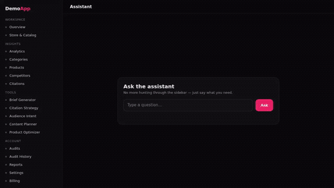

# demowright

[](https://www.npmjs.com/package/@matte97p/demowright)
[](https://www.npmjs.com/package/@matte97p/demowright)
[](https://github.com/matte97p/demowright/stargazers)
[](LICENSE)
[](https://nodejs.org/)

<p align="center"></p>

> ☝️ This GIF was rendered by demowright itself, from the bundled [`examples/local-demo.config.js`](examples/local-demo.config.js). Change the UI, re-run, and it's current again.

Product demo videos rot the moment you touch the UI. You record a beautiful 40-second walkthrough, ship a redesign two weeks later, and now the video is a lie — but re-recording it by hand is annoying enough that nobody does it.

So I wrote this: a demo video you describe as a **script that lives in your repo**. Playwright drives the browser, and the polish — captions, a smooth synthetic cursor, auto-zoom on what matters, an end card — is painted straight into the recording. No external editor, no SaaS, no "click here to start your trial". When the UI changes, you re-run it in CI and the video is current again.

```bash
npm install --save-dev @matte97p/demowright
npx playwright install chromium   # the browser it drives
npx demowright init               # writes a starter demowright.config.js
npx demowright run demowright.config.js -o output/demo.mp4
```

## What a demo looks like

A demo is a plain object: where to start, and an ordered list of steps. This is the bundled example (`examples/local-demo.config.js`):

```js
import { defineDemo } from 'demowright'

export default defineDemo({
  name: 'local-demo',
  url: 'http://localhost:3000',
  viewport: { width: 1280, height: 720 },
  theme: { accent: '#e91e63' },
  formats: ['landscape'],          // add 'square' and 'vertical' for social
  steps: [
    { type: 'caption', text: 'Too many items in the sidebar.', duration: 2600 },
    { type: 'highlight', selector: '.sidebar', duration: 1500 },
    { type: 'zoom', selector: '.sidebar', scale: 1.2 },
    { type: 'zoomReset' },
    { type: 'caption', text: 'Or: just ask.' },
    { type: 'type', selector: '#q', text: 'How does ChatGPT see me?' },
    { type: 'click', selector: '#ask' },
    { type: 'wait', selector: '#result .done' },
    { type: 'zoom', selector: '.assistant', scale: 1.25 },
    { type: 'endcard', title: 'My Product', subtitle: 'myproduct.com' },
  ],
})
```

Run it and you get `output/demo.mp4` — captions, cursor, and zooms baked in.

## Steps

| type | fields | what it does |
|---|---|---|
| `caption` | `text`, `duration?`, `hold?` | show a caption (bottom center). `hold: true` keeps it until `captionHide` |
| `captionHide` | — | hide the current caption |
| `goto` | `url` | navigate mid-demo (overlay re-installs automatically) |
| `move` | `selector` \| `x`+`y`, `duration?` | glide the synthetic cursor |
| `click` | `selector`, `duration?` | move the cursor there, pulse, and really click |
| `type` | `selector`, `text`, `perChar?`, `clear?` | focus and type, character by character |
| `key` | `key` | press a key (e.g. `"Enter"`) |
| `highlight` | `selector`, `pad?`, `duration?` | draw a ring around an element |
| `highlightHide` | — | remove the ring |
| `zoom` | `selector`, `scale?`, `duration?` | smoothly zoom toward an element |
| `zoomReset` | `duration?` | zoom back out |
| `scroll` | `selector` \| `y`, `duration?` | smooth-scroll to an element or offset |
| `wait` | `duration` \| `selector` | pause for ms, or until an element is visible |
| `endcard` | `title`, `subtitle?`, `duration?` | full-screen closing card |

Timing is real-time: a `caption` with `duration: 2600` is on screen for 2.6 seconds of video. `wait` with a `selector` is how you sync to your app actually doing something (a request finishing, a result rendering) instead of guessing milliseconds.

## CLI

```
demowright run <config.js> [options]
  -o, --out <file>      output path (default: output/<name>.mp4)
  -f, --format <list>   landscape,square,vertical  (overrides config)
  -m, --music <file>    background music track
      --keep-raw        keep the intermediate .webm

demowright init [dir]   write a starter config
demowright --version
```

## As a library

```js
import { recordDemo } from 'demowright'

const { outputs } = await recordDemo(demo, {
  out: 'output/demo.mp4',
  formats: ['landscape', 'vertical'],
  onStep: (i, step) => console.log(i, step.type),
})
```

## Social formats

One capture, three crops — so you don't record three times:

- `landscape` — 1280×720, for the site / YouTube / X
- `square` — 1080×1080, center-cropped, for the LinkedIn / Instagram feed
- `vertical` — 1080×1920, the landscape centered over a blurred fill, for Reels / Shorts

## How it works

`addInitScript` installs a tiny overlay runtime (`window.__dw`) into the page before its own scripts run, so it survives navigation. The runner drives it over `page.evaluate` while Playwright records the context video. Because the overlay is real DOM and the zoom is a CSS transform on `<body>`, all of it is captured in the same frames — there is no compositing step. The raw `.webm` is then muxed to H.264 MP4 (and any extra crops) with a bundled static ffmpeg.

The overlay attaches itself to `<html>` rather than `<body>`, so the zoom transform never scales the captions or the cursor — they stay crisp while the page zooms underneath them.

## Requirements

- Node ≥ 20
- Chromium, via `npx playwright install chromium` (headless — runs fine on a server / in CI with no display)
- ffmpeg is bundled (`ffmpeg-static`); nothing to install on the system

## License

MIT © Matteo Perino

## Related tools

Part of my open-source toolkit — [github.com/matte97p](https://github.com/matte97p):

- [rlsgrid](https://github.com/matte97p/rlsgrid) — catch cross-tenant Row-Level Security leaks in Postgres/Supabase
- [pentest-framework](https://github.com/matte97p/pentest-framework) — low-noise pentest orchestration, normalized to one schema and rendered to a PDF
- [GeoSuite CLIs](https://github.com/TryGeoSuite) — zero-dep Generative Engine Optimization toolkit

---

⭐ If demowright saved you a re-recording, [give it a star](https://github.com/matte97p/demowright) — it helps other people find it.
