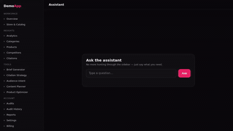

# demowright

[](https://www.npmjs.com/package/@matte97p/demowright)
[](https://www.npmjs.com/package/@matte97p/demowright)
[](https://github.com/matte97p/demowright/stargazers)
[](LICENSE)
[](https://nodejs.org/)

<p align="center"></p>

> ☝️ This GIF was rendered by demowright itself, from the bundled [`examples/local-demo.config.js`](examples/local-demo.config.js). Change the UI, re-run, and it's current again.

Product demo videos rot the moment you touch the UI. You record a beautiful 40-second walkthrough, ship a redesign two weeks later, and now the video is a lie — but re-recording it by hand is annoying enough that nobody does it.

So I wrote this: a demo video you describe as a **script that lives in your repo**. Playwright drives the browser, and the polish — captions, a smooth synthetic cursor, auto-zoom on what matters, an end card — is painted straight into the recording. No external editor, no SaaS, no "click here to start your trial". When the UI changes, you re-run it in CI and the video is current again.

```bash
npm install --save-dev @matte97p/demowright
npx playwright install chromium   # the browser it drives
npx demowright init               # writes a starter demowright.config.js
npx demowright run demowright.config.js -o output/demo.mp4
```

## What a demo looks like

A demo is a plain object: where to start, and an ordered list of steps. This is the bundled example (`examples/local-demo.config.js`):

```js
import { defineDemo } from 'demowright'

export default defineDemo({
  name: 'local-demo',
  url: 'http://localhost:3000',
  viewport: { width: 1280, height: 720 },
  theme: { accent: '#e91e63' },
  formats: ['landscape'],          // add 'square' and 'vertical' for social
  steps: [
    { type: 'caption', text: 'Too many items in the sidebar.', duration: 2600 },
    { type: 'highlight', selector: '.sidebar', duration: 1500 },
    { type: 'zoom', selector: '.sidebar', scale: 1.2 },
    { type: 'zoomReset' },
    { type: 'caption', text: 'Or: just ask.' },
    { type: 'type', selector: '#q', text: 'How does ChatGPT see me?' },
    { type: 'click', selector: '#ask' },
    { type: 'wait', selector: '#result .done' },
    { type: 'zoom', selector: '.assistant', scale: 1.25 },
    { type: 'endcard', title: 'My Product', subtitle: 'myproduct.com' },
  ],
})
```

Run it and you get `output/demo.mp4` — captions, cursor, and zooms baked in.

## Steps

| type | fields | what it does |
|---|---|---|
| `caption` | `text`, `duration?`, `hold?`, `style?`, `accent?` | show a caption (bottom center). `hold: true` keeps it until `captionHide`. `style: 'words'` reveals it word by word, with the words in `accent` in the theme colour |
| `captionHide` | — | hide the current caption |
| `goto` | `url` | navigate mid-demo (overlay re-installs automatically) |
| `move` | `selector` \| `x`+`y`, `duration?` | glide the synthetic cursor |
| `click` | `selector`, `duration?` | move the cursor there, pulse, and really click |
| `type` | `selector`, `text`, `perChar?`, `clear?` | focus and type, character by character |
| `key` | `key` | press a key (e.g. `"Enter"`) |
| `highlight` | `selector`, `pad?`, `duration?` | draw a ring around an element |
| `highlightHide` | — | remove the ring |
| `zoom` | `selector`, `scale?`, `duration?` | smoothly zoom toward an element |
| `zoomReset` | `duration?` | zoom back out |
| `scroll` | `selector` \| `y`, `duration?` | smooth-scroll to an element or offset |
| `wait` | `duration` \| `selector` | pause for ms, or until an element is visible |
| `scene` | `title`, `preset?`, `subtitle?`, `accent?`, `items?`, `duration?` | full-screen animated card: `title` (default), `list` (needs `items`) or `outro`. See [Motion scenes](#motion-scenes) |
| `endcard` | `title`, `subtitle?`, `duration?` | closing card: a `scene` with `preset: 'outro'` that stays on screen to the end |

Timing is real-time: a `caption` with `duration: 2600` is on screen for 2.6 seconds of video. `wait` with a `selector` is how you sync to your app actually doing something (a request finishing, a result rendering) instead of guessing milliseconds.

## CLI

```
demowright run <config.js> [options]
  -o, --out <file>      output path (default: output/<name>.mp4)
  -f, --format <list>   landscape,square,vertical  (overrides config)
  -m, --music <file>    background music track
      --keep-raw        keep the intermediate .webm
      --dry-run         validate the config and print the planned timeline; record nothing

demowright init [dir]   write a starter config
demowright --version
```

`--dry-run` is also a quick config validator: it normalizes the demo (throwing on the first problem), then prints the step timeline, the estimated length, and which lines will be narrated — without launching a browser.

## As a library

```js
import { recordDemo } from 'demowright'

const { outputs } = await recordDemo(demo, {
  out: 'output/demo.mp4',
  formats: ['landscape', 'vertical'],
  onStep: (i, step) => console.log(i, step.type),
})
```

TypeScript types ship with the package, so `defineDemo`, the step shapes, and `recordDemo` autocomplete in your editor.

## Social formats

One capture, three crops, so you don't record three times (scenes are the exception: they are recorded at each format's size, see [Motion scenes](#motion-scenes)):

- `landscape` — 1280×720, for the site / YouTube / X
- `square` — 1080×1080, center-cropped, for the LinkedIn / Instagram feed
- `vertical` — 1080×1920, the landscape centered over a blurred fill, for Reels / Shorts

With a [backdrop](#backdrop-optional), every format shows the whole capture as a window over the animated background instead.

## Motion scenes

A demo usually needs a little around the recording: an opening title, a beat that names what comes next, a closing card. `scene` steps are those, animated (words revealed from blur, cards sliding in, a slowly drifting background) and placed anywhere in `steps`.

```js
steps: [
  { type: 'scene', title: 'Your demo, as code. Always current.', accent: 'code.', subtitle: 'demowright' },
  { type: 'caption', text: 'Too many items in the sidebar.', style: 'words', accent: 'Too many' },
  // …
  { type: 'scene', preset: 'list', title: 'Or: just ask.', accent: 'ask.', items: [
    { label: 'Type the question', hint: 'in plain words' },
    'Read the answer',
  ] },
  // …
  { type: 'scene', preset: 'outro', title: 'My Product', subtitle: 'myproduct.com' },
]
```

- **Presets**: `title` (the default) reveals the title word by word with an optional `subtitle`; `list` adds `items` (strings, or `{ label, hint }`) as cards; `outro` is the closing card, and `endcard` is now shorthand for it.
- **`accent`** lists the words of the title drawn in `theme.accent`, matched without case or punctuation.
- **Theme**: scenes read `theme.accent`, `theme.font` and `theme.background` (default `#07070a`). Fonts are the ones installed where the render runs: nothing is fetched, so a render works offline.
- **Recorded per format.** A scene is its own HTML page, recorded by Playwright at the exact size of every format you ask for, so a centered title is not cut by the square crop or shrunk by the vertical one. During the capture the page is covered for the scene's duration, and the render swaps that stretch for the scene clip of the same length: narration and music stay where they were.
- **Cut on the frames, not on the clock.** The cover carries two small colour cells in its top-left corner, and the render finds the stretches by reading them from the decoded video. The wall clock runs 0.1 to 0.25 s off the capture depending on the machine, so cutting on it would flash the cover. Keep that corner of the page free of anything drawn on top during a scene.
- **`endcard` stays to the end**, like it always did, even with steps after it. An explicit `scene` uncovers the page when it is done, unless it is the last step.
- **Without the clips** (calling `runDemo` and `renderVideo` yourself), a scene renders as a plain card with its title, and its marker is painted over.
- **An opening scene also hides the page load**: it replaces the capture from its very first frame, so the video starts on the title instead of a white page.

Each scene costs one short extra recording per format, in real time; formats record side by side, and while they do the voiceover is synthesized. `node scripts/frame-check.mjs` renders `examples/scenes.config.js` and reports how many frames those real-time recordings dropped on your machine; CI runs it on every pull request.

## Backdrop (optional)

`backdrop: true` shows the capture as a browser window over the same animated background the scenes use, instead of filling the frame:

```js
export default defineDemo({
  url: 'https://app.example.com',
  backdrop: { frame: 'browser', scale: 0.86, url: 'app.example.com' },
  steps: [/* … */],
})
```

- `frame`: `browser` (an address bar with the three dots) or `none` (just the rounded window).
- `scale`: how much of the frame the window takes, in both directions, from 0.5 to 1 (default 0.86).
- `url`: the text in the address bar, by default the host of the demo `url` (nothing for a `file://` page).

It changes the social formats too: with a backdrop, `square` and `vertical` show the whole window over the background instead of a center crop or a blurred copy. The background is a 12-second loop recorded once per format, so a long demo costs no more than a short one.

## Voiceover (optional)

Off by default. Add a `voice` block and a `say` line on the steps you want narrated — demowright synthesizes each line, drops it at the moment that step runs, and ducks the music underneath it (with a fade in/out on the track).

```js
export default defineDemo({
  url: 'http://localhost:3000',
  music: './assets/track.mp3',
  voice: { provider: 'openai', voice: 'alloy' }, // or { provider: 'elevenlabs', voice: '<id>' }
  steps: [
    { type: 'caption', text: 'Too many items in the sidebar.', say: 'The sidebar is doing too much.' },
    { type: 'click', selector: '#ask' },
    { type: 'caption', text: 'Or: just ask.', say: 'So instead, you just ask.' },
  ],
})
```

- `say` is the spoken line for a step — it can differ from the on-screen `caption` (captions read well short; narration reads well as a full sentence).
- `voice.fromCaptions: true` narrates each caption's own `text` when it has no explicit `say`.
- Built-in providers: `openai` (key from `OPENAI_API_KEY`) and `elevenlabs` (`ELEVENLABS_API_KEY`). Keys are read from the environment **by name**, never from the config — set `apiKeyEnv` to point at a different variable.
- Bring your own: `voice: async (text) => Buffer` — wire up any TTS, including a local engine.

Identical lines are synthesized once and reused.

## How it works

`addInitScript` installs a tiny overlay runtime (`window.__dw`) into the page before its own scripts run, so it survives navigation. The runner drives it over `page.evaluate` while Playwright records the context video. Because the overlay is real DOM and the zoom is a CSS transform on `<body>`, all of it is captured in the same frames — there is no compositing step. The raw `.webm` is then muxed to H.264 MP4 (and any extra crops) with a bundled static ffmpeg.

The overlay attaches itself to `<html>` rather than `<body>`, so the zoom transform never scales the captions or the cursor — they stay crisp while the page zooms underneath them.

## Requirements

- Node ≥ 20
- Chromium, via `npx playwright install chromium` (headless — runs fine on a server / in CI with no display)
- ffmpeg is bundled (`ffmpeg-static`); nothing to install on the system

## License

MIT © Matteo Perino

## Related tools

Part of my open-source toolkit — [github.com/matte97p](https://github.com/matte97p):

- [rlsgrid](https://github.com/matte97p/rlsgrid) — catch cross-tenant Row-Level Security leaks in Postgres/Supabase
- [pentest-framework](https://github.com/matte97p/pentest-framework) — low-noise pentest orchestration, normalized to one schema and rendered to a PDF
- [GeoSuite CLIs](https://github.com/TryGeoSuite) — zero-dep Generative Engine Optimization toolkit

---

⭐ If demowright saved you a re-recording, [give it a star](https://github.com/matte97p/demowright) — it helps other people find it.


---

<sub>🌐 Built by **Matteo Perino** — [matteoperino.dev](https://matteoperino.dev)</sub>
